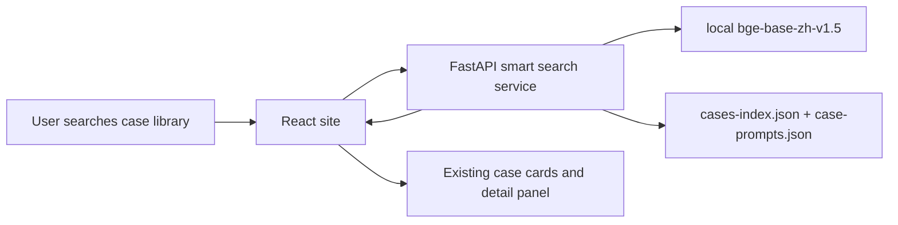

# Smart Case Search Design

## Decision

Build a separate Python FastAPI service for semantic search over the public case library. The service owns BGE inference, case indexing, and search ranking. The existing React image generation site calls this service from the case-library search UI.

This first version is semantic image-case search, not a chat assistant. It does not search private user history and does not require Gemini or another LLM.

## Goals

- Let users search public image cases by intent, style, scene, object, or rough Chinese description.
- Reuse the existing public case data and existing card/detail/copy/apply UI.
- Keep production deployment simple: one Python service with `bge-base-zh-v1.5` loaded locally.
- Keep the site usable if the semantic search service is unavailable.

## Non-Goals

- No user history search.
- No image-to-image similarity search in this version.
- No LLM-generated answers, prompt rewriting, or conversational flow.
- No dependency on the existing Node local API for production semantic search.

## Architecture

The system has two runtime pieces:

1. React frontend in `custom-image-generator-web`.
2. New FastAPI search service with local `bge-base-zh-v1.5`.

The frontend remains the source of the user experience. The search service only returns ranked case IDs and scores. The frontend maps those IDs back to the already loaded case records and renders the existing cards.



## Search Service

The FastAPI service loads these files from the web project:

- `public/cases-index.json`
- `public/case-prompts.json`

For each case, it builds one searchable text document from:

- title
- category
- styles
- scenes
- source label
- prompt preview
- full prompt

At startup, the service creates or loads embeddings for all public cases. The case library is small enough that a simple in-memory vector index is acceptable for v1. The service can persist embeddings to a local cache file so restarts do not need to recompute every vector.

Recommended local service folder:

```text
custom-image-generator-web/search-service
```

## API

### `GET /health`

Returns service status, model load status, and case count.

Example response:

```json
{
  "ok": true,
  "model": "bge-base-zh-v1.5",
  "caseCount": 442
}
```

### `POST /search`

Request:

```json
{
  "query": "高级感产品海报",
  "category": "全部",
  "topK": 24
}
```

Response:

```json
{
  "results": [
    {
      "id": "case-id",
      "score": 0.82
    }
  ]
}
```

Rules:

- Empty query returns no semantic results; the frontend keeps the default featured/category view.
- `topK` defaults to 24 and should be capped server-side.
- Category filtering can be applied before ranking when a specific category is selected.
- Unknown case IDs are ignored by the frontend.

## Frontend Behavior

The existing case-library search input becomes smart-search aware.

When `VITE_CASE_SEARCH_API_URL` is configured:

1. Debounce the user's query.
2. Send `query`, selected category, and `topK` to `/search`.
3. Render cases in the returned order.
4. Keep existing detail, copy prompt, and apply prompt behavior.

If the search API is missing, slow, or returns an error:

- Fall back to the current local keyword search.
- Do not block image generation.
- Do not show a disruptive error state; a small "keyword search" fallback state is enough.

When `VITE_CASE_SEARCH_API_URL` is not configured, the site behaves exactly as it does now.

## Configuration

Frontend environment variable:

```text
VITE_CASE_SEARCH_API_URL=https://image-search.ctikki.com
```

Local development value:

```text
VITE_CASE_SEARCH_API_URL=http://127.0.0.1:8790
```

Search service environment variables:

```text
BGE_MODEL_PATH=/models/bge-base-zh-v1.5
CASE_INDEX_PATH=/app/public/cases-index.json
CASE_PROMPTS_PATH=/app/public/case-prompts.json
EMBEDDING_CACHE_PATH=/app/.cache/case-embeddings.json
ALLOWED_ORIGINS=https://image.ctikki.com,http://127.0.0.1:5174
PORT=8790
```

## Error Handling

- Model load failure: `/health` returns `ok: false`; `/search` returns HTTP 503.
- Missing case files: service starts with a clear startup error.
- Embedding cache mismatch: rebuild cache from current case data.
- Frontend request timeout: fall back to keyword search.
- CORS rejection: fail closed; only configured origins can call the service.

## Testing

Backend checks:

- Health endpoint returns loaded model and case count.
- Search returns stable ranked IDs for a known query.
- Category filter limits results.
- Empty query returns no semantic results.
- Cache rebuild works when case data changes.

Frontend checks:

- With API configured, search results follow returned ID order.
- If API fails, keyword fallback still works.
- Existing copy/apply prompt flows are unchanged.
- Existing case-library contract and performance checks still pass.

## Rollout

1. Add the FastAPI search service.
2. Add frontend smart-search integration behind `VITE_CASE_SEARCH_API_URL`.
3. Verify locally with `http://127.0.0.1:8790`.
4. Deploy service on the cloud server with local BGE model.
5. Set production frontend env var to the search service URL.

## Future Extension

After semantic search is stable, a second version can add a real creative assistant:

- Gemini rewrites vague user intent into better search queries.
- Gemini explains why selected cases match.
- Gemini converts selected cases into a ready-to-generate prompt.
- Image embeddings can support "find visually similar images" later.
