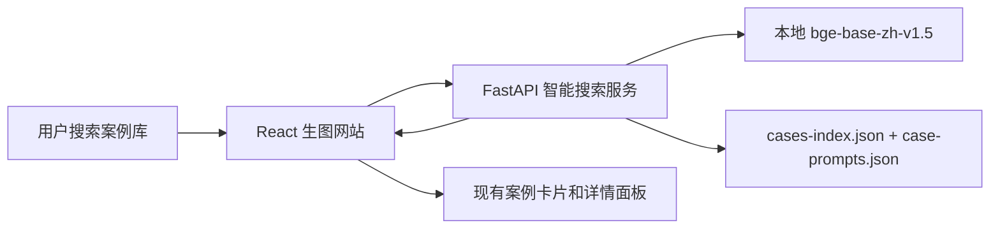

# 智能案例搜索设计

## 结论

新增一个独立的 Python FastAPI 搜索服务，用来给公共案例库做语义搜索。这个服务自己加载 `bge-base-zh-v1.5`，自己建立案例向量索引，自己完成搜索排序。现有 React 生图网站只负责调用这个服务，并继续使用已有的案例卡片、详情、复制 prompt、应用 prompt 流程。

第一版只做“语义找图”，不是聊天式创作助手。不搜索用户历史生成图，也不需要 Gemini 或其他 LLM。

## 目标

- 用户可以用意图、风格、场景、对象或模糊中文描述搜索公共案例。
- 复用现有公共案例数据，不重新设计案例库。
- 部署简单：云服务器上跑一个 Python 服务，本地加载 `bge-base-zh-v1.5`。
- 搜索服务不可用时，网站仍然可用，自动退回现在的关键词搜索。

## 不做什么

- 不搜索用户历史生成记录。
- 不做以图搜图或视觉相似图搜索。
- 不做 LLM 对话、prompt 改写、推荐理由生成。
- 不依赖现有 Node 本地 API 来承载生产搜索。

## 架构

系统运行时分成两块：

1. `custom-image-generator-web` 里的 React 前端。
2. 新增 FastAPI 搜索服务，服务内置本地 BGE 模型。

前端仍然负责用户体验。搜索服务只返回排序后的案例 `id` 和相似度分数。前端拿到 `id` 后，用已有案例数据映射回完整案例，再按返回顺序展示卡片。



## 搜索服务

FastAPI 服务读取网站现有公共案例数据：

- `public/cases-index.json`
- `public/case-prompts.json`

每个案例会拼成一段可检索文本，包含：

- 标题
- 分类
- 风格标签
- 场景标签
- 来源名称
- prompt 预览
- 完整 prompt

服务启动时为全部公共案例生成或加载 embedding。当前案例库规模不大，第一版用内存向量索引即可。为了减少重启耗时，embedding 可以缓存到本地文件；当案例数据变化时，缓存自动重建。

建议目录：

```text
custom-image-generator-web/search-service
```

## API 设计

### `GET /health`

返回服务状态、模型加载状态和案例数量。

示例：

```json
{
  "ok": true,
  "model": "bge-base-zh-v1.5",
  "caseCount": 442
}
```

### `POST /search`

请求：

```json
{
  "query": "高级感产品海报",
  "category": "全部",
  "topK": 24
}
```

返回：

```json
{
  "results": [
    {
      "id": "case-id",
      "score": 0.82
    }
  ]
}
```

规则：

- 空搜索词不返回语义结果，前端继续展示默认精选或分类结果。
- `topK` 默认 24，服务端需要设置上限。
- 如果用户选择了具体分类，服务端先按分类过滤，再做排序。
- 前端遇到不存在的案例 `id` 时直接忽略。

## 前端行为

现有案例库搜索框升级为“智能搜索优先”：

当配置了 `VITE_CASE_SEARCH_API_URL`：

1. 用户输入搜索词后做 debounce。
2. 前端向 `/search` 发送 `query`、当前分类、`topK`。
3. 前端按服务端返回的 `id` 顺序展示案例。
4. 保留现有详情、复制 prompt、应用 prompt 流程。

如果搜索 API 没配置、超时或报错：

- 自动退回当前本地关键词搜索。
- 不影响生图主流程。
- 不弹干扰性错误；最多显示一个轻量的“关键词搜索”状态。

如果没有配置 `VITE_CASE_SEARCH_API_URL`，网站行为和现在完全一致。

## 配置

前端环境变量：

```text
VITE_CASE_SEARCH_API_URL=https://image-search.ctikki.com
```

本地开发：

```text
VITE_CASE_SEARCH_API_URL=http://127.0.0.1:8790
```

搜索服务环境变量：

```text
BGE_MODEL_PATH=/models/bge-base-zh-v1.5
CASE_INDEX_PATH=/app/public/cases-index.json
CASE_PROMPTS_PATH=/app/public/case-prompts.json
EMBEDDING_CACHE_PATH=/app/.cache/case-embeddings.json
ALLOWED_ORIGINS=https://image.ctikki.com,http://127.0.0.1:5174
PORT=8790
```

## 错误处理

- 模型加载失败：`/health` 返回 `ok: false`，`/search` 返回 HTTP 503。
- 案例文件缺失：服务启动时报明确错误。
- embedding 缓存和案例数据不一致：自动重建缓存。
- 前端请求超时：退回关键词搜索。
- CORS：只允许配置过的域名访问，默认拒绝。

## 验收测试

后端需要验证：

- `/health` 返回模型状态和案例数量。
- 固定搜索词能返回稳定的排序结果。
- 分类过滤生效。
- 空搜索词不返回语义结果。
- 案例数据变化后缓存能重建。

前端需要验证：

- 配置 API 后，展示顺序跟搜索服务返回顺序一致。
- API 失败时，关键词搜索仍然可用。
- 复制 prompt、应用 prompt 不受影响。
- 现有案例库契约和性能检查继续通过。

## 上线步骤

1. 新增 FastAPI 搜索服务。
2. 在前端接入 `VITE_CASE_SEARCH_API_URL`，保持可降级。
3. 本地用 `http://127.0.0.1:8790` 验证。
4. 云服务器部署搜索服务，并挂载本地 BGE 模型。
5. 给生产前端配置搜索服务地址。

## 后续扩展

语义搜索稳定后，再做真正的创作助手：

- 用 Gemini 把模糊需求改写成更适合搜索的查询。
- 让 Gemini 解释为什么推荐这些案例。
- 让 Gemini 基于选中的案例生成可直接用于生图的 prompt。
- 后续接图像 embedding，支持“找类似图片”。
